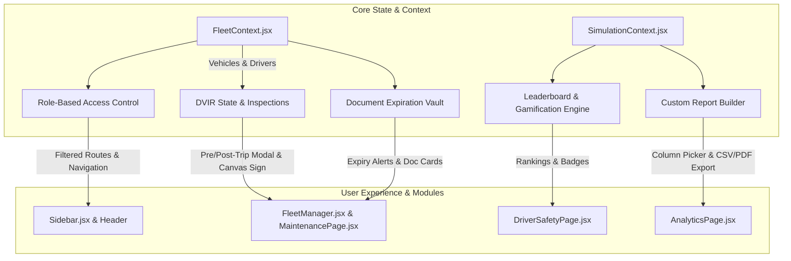

# Implementation Plan: Pure Software Features (1, 6, 7, 10, 11) for VelocIQ

This engineering blueprint outlines the phased design and implementation for five high-value, pure-software modules in **VelocIQ**:
- **Feature 1:** Digital Vehicle Inspection Reports (DVIR)
- **Feature 6:** Driver Qualification & Document Expiration Vault (DQF)
- **Feature 7:** Driver Gamification & Fleet Leaderboard
- **Feature 10:** Role-Based Access Control (RBAC) & Persona Switcher
- **Feature 11:** Custom Report Builder & Scheduled Export Engine

---

## 1. Architectural Blueprint & Touchpoints



---

## 2. Feature-by-Feature Detailed Specifications

### 📋 Feature 1: Digital Vehicle Inspection Reports (DVIR)
* **Objective:** Enable drivers to conduct formal, paperless pre-trip and post-trip vehicle safety walkaround inspections before vehicle dispatch.
* **Component Location:** `src/components/dvir/DVIRInspectionModal.jsx` and `src/components/dvir/DVIRHistoryTable.jsx`.
* **Integration Points:**
  - Integrated into `src/pages/FleetManager.jsx` (as an "Inspect Vehicle" action per card) and `src/pages/MaintenancePage.jsx`.
  - State hook in `FleetContext.jsx`: `inspections` array and `submitInspection(vehicleId, report)`.
* **Key Capabilities:**
  1. **Inspection Walkaround Checklist (7 Categories):**
     - Brakes & Air Lines
     - Tires & Wheels (tread depth, lug nuts)
     - Steering Mechanism & Suspension
     - Lights, Turn Indicators & Reflectors
     - Windshield & Wipers
     - Fluid Levels (Oil, Coolant, Brake Fluid)
     - Emergency Safety Kit & Fire Extinguisher
  2. **Defect Severity & Auto-Grounding:**
     - Toggles: `Pass` (Green), `Minor Defect` (Amber - Safe to drive), `Critical Defect` (Red - Out of Service).
     - If any item is marked `Critical Defect`, vehicle status in `FleetContext` is automatically shifted to **`Maintenance`** and immobilizer warning is flagged.
  3. **Digital Signature Pad:**
     - HTML5 Canvas signature capture allowing driver touch/mouse signature certification.
  4. **Inspection Records Ledger:**
     - View previous inspection timestamps, certifying driver, odometer reading, and pass/fail summary.

---

### 🪪 Feature 6: Driver Qualification & Document Expiration Vault (DQF)
* **Objective:** Protect fleets from legal liability by tracking and warning about expiring licenses, medical cards, and vehicle certifications.
* **Component Location:** `src/components/compliance/DocumentVaultModal.jsx` and `src/components/compliance/ComplianceBadge.jsx`.
* **Integration Points:**
  - Embedded as a dedicated tab/panel in `src/pages/FleetManager.jsx` and warning banners in the main dashboard header.
  - Linked to `drivers` and `vehicles` in `FleetContext.jsx`.
* **Key Capabilities:**
  1. **Document Registry Schema:**
     - **Driver Documents:** Commercial Driver's License (CDL), Medical Examiner's Certificate (DOT Card), HazMat Endorsement, Annual MVR Review.
     - **Vehicle Documents:** Commercial Registration, Fleet Insurance Policy, PUC Emission Certificate, Annual DOT Inspection.
  2. **Automated Expiry Engine:**
     - Computes days remaining until expiration (`Date.now() - expiryDate`).
     - Three Status Bands:
       - 🟢 **Valid:** > 30 days remaining.
       - 🟡 **Expiring Soon:** $\le$ 30 days remaining (amber warning banner in Fleet Manager).
       - 🔴 **Expired:** Overdue (critical alert banner; driver disqualified from dispatch).
  3. **Document Action Center:**
     - Quick "Renew / Update Expiry" modal to extend certificates.
     - Mock PDF / scan viewer preview.

---

### 🏆 Feature 7: Driver Gamification & Fleet Leaderboard
* **Objective:** Motivate drivers and reduce fuel consumption through peer competition, achievement badges, and targeted micro-coaching.
* **Component Location:** `src/components/gamification/FleetLeaderboard.jsx` and `src/components/gamification/DriverBadges.jsx`.
* **Integration Points:**
  - Directly embedded into `src/pages/DriverSafetyPage.jsx` as a premier tab alongside Kinetic Telematics.
* **Key Capabilities:**
  1. **Algorithmic Composite Driver Index (0–100):**
     $$\text{Composite Score} = 0.45 \times \text{Safety Score} + 0.35 \times \text{Fuel Aero Efficiency} + 0.20 \times \text{On-Time Compliance}$$
  2. **Interactive Fleet Leaderboard:**
     - Ranks all fleet drivers (Sarah Jenkins, Elena Rodriguez, Marcus Cole, James Wilson) with tier badges (`Master Tier`, `Gold`, `Silver`, `Bronze`).
     - Highlights rank movement ($\Delta +2$, $\Delta -1$) and weekly fuel saved in liters.
  3. **Achievement Badges:**
     - 🛡️ **Iron Brake**: 0 harsh braking events over the last 150 km.
     - 💨 **Aero Whisperer**: Kept in the 55–65 km/h aerodynamic sweet spot for > 85% of trip time.
     - 🚦 **GLOSA Virtuoso**: 0 stop-and-go kinetic waste penalties on signalized corridors.
     - 🔋 **Limp-Home Survivor**: Successfully completed emergency route under autonomous velocity governor.
  4. **Targeted Micro-Coaching Drills:**
     - Context-aware coaching modules triggered by the driver's specific lowest metric (e.g. "Kinetic Brake Dissipation Coaching" for heavy brakers).

---

### 🔐 Feature 10: Role-Based Access Control (RBAC) & Persona Switcher
* **Objective:** Present tailored interfaces based on organizational roles (Dispatchers, Safety Officers, Mechanics, and Drivers) while securing sensitive controls.
* **Component Location:** `src/context/AuthContext.jsx` and `src/components/RoleSwitcher.jsx`.
* **Integration Points:**
  - Wraps routes in `src/App.jsx` and filters navigation items in `src/components/Sidebar.jsx`.
* **Key Roles & Permissions Matrix:**

| Role | Accessible Modules | Restricted / Hidden Modules |
| :--- | :--- | :--- |
| **Fleet Administrator** | All 10 Modules + Full Settings + Remote Immobilizer | None |
| **Terminal Dispatcher** | Dashboard, Navigation, Fleet Garage, Trip Logger | AI Model Tuner, Threat Defense, Immobilizer |
| **Safety Officer** | Driver Safety, Fleet Leaderboard, Incident Logs, Analytics | Engine Twin, Remote ECU Lock, Route Creation |
| **Maintenance Technician** | Maintenance Tracker, DVIR Inspections, Engine Twin, ECU DTCs | Driver Leaderboard, Navigation Dispatch |
| **Driver Portal** | Dedicated Single-Screen Mobile HUD: My Route, My Score, DVIR Pre-Trip, SOS Button | All administrative & fleet-wide views |

* **Interactive Role Switcher:**
  - A clean dropdown in the top header or sidebar allowing the user to seamlessly switch between all 5 personas in real-time to test and demo permission views.

---

### 📊 Feature 11: Custom Report Builder & Scheduled Export Engine
* **Objective:** Give fleet managers custom data querying, CSV spreadsheet generation, printable executive PDFs, and scheduled digest automation.
* **Component Location:** `src/components/reporting/CustomReportBuilder.jsx` and `src/utils/exportUtils.js`.
* **Integration Points:**
  - Adds a new "Reporting & Exports" workbench inside `src/pages/AnalyticsPage.jsx`.
* **Key Capabilities:**
  1. **Column & Dimension Selector:**
     - Choose columns: *Vehicle Name, License Plate, Driver, Distance (km), Fuel Consumed (L), Fuel Saved (L), Avg Speed, Harsh Brakes, Safety Score, Kinetic Waste (kJ), Fault DTCs*.
  2. **Filter & Date Presets:**
     - Quick ranges: *Current Trip, Today (Last 24h), Past 7 Days, Month-to-Date*.
     - Filter by Vehicle Profile (Sedan, SUV, Hatchback) or Driver.
  3. **Instant CSV Generator:**
     - Pure client-side RFC 4180-compliant CSV generator with automatic blob download (`velociq_fleet_report_2026-10-03.csv`).
  4. **Executive Summary PDF / Print Preview:**
     - Clean, branded executive printable layout formatted with high-level KPI stat cards and summary tables.
  5. **Simulated Automated Email Digest:**
     - Setup weekly/daily report triggers with toast confirmation and sample email payload preview.

---

## 3. Phased Implementation Schedule

```
Phase 1: Foundation & RBAC
├── Create AuthContext with Role Switcher (Admin, Dispatcher, Safety, Tech, Driver)
└── Filter Sidebar links and secure routes according to role

Phase 2: Operations & Compliance (Features 1 & 6)
├── Build DVIR Pre/Post-Trip Inspection Modal with Canvas signature
├── Connect critical defects to FleetContext vehicle auto-grounding
└── Build Document Expiration Vault (DQF) with 30-day warning badges

Phase 3: Engagement & Analytics (Features 7 & 11)
├── Build Fleet Leaderboard & Achievement Badges in DriverSafetyPage
├── Build Custom Report Builder in AnalyticsPage with column picker
└── Implement Client-Side CSV & Executive Print/PDF Export utility
```

---

## 4. Acceptance Criteria & Verification

1. **DVIR:** Completing an inspection with a critical brake defect immediately flags the vehicle as "Maintenance" in the fleet map.
2. **DQF:** An expired CDL or insurance document renders a visible amber/red alert pill on the driver's roster card.
3. **Gamification:** Driver leaderboard ranks drivers accurately using the composite score formula; achievement badges render dynamically.
4. **RBAC:** Switching to "Driver Portal" displays only the driver's route, safety score, and inspection, while "Maintenance Tech" sees DTCs and wear without dispatcher tools.
5. **Report Builder:** Selecting 4 columns and clicking "Export to CSV" triggers an immediate `.csv` browser download containing valid row data.
