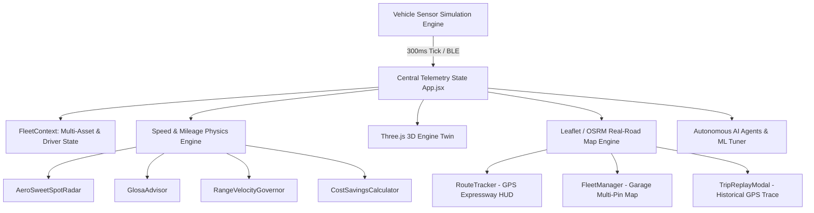

# VelocIQ Platform: Complete Technical & Feature Documentation

> **Autonomous Fleet Telematics, Speed-to-Mileage Physics Engine, and Digital Twin Intelligence**  
> *Version 1.0.0 Production Architecture*

---

## 1. Executive Summary & Core Mission

**VelocIQ** is an enterprise-grade connected vehicle telematics and intelligent fleet management platform. Built to solve the fundamental physical contradiction of modern fleet logistics—**the non-linear penalty of speed on fuel/energy economy**—VelocIQ combines real-time ECU telemetry, aerodynamic physics modeling, autonomous AI dispatch agents, an interactive 3D WebGL engine digital twin, and real-road GPS telematics into a single unified command center.

### Primary Operational Objectives:
1. **Overcome the Cubic Drag Tax ($P \propto v^3$)**: Provide drivers and fleet dispatchers with real-time visual awareness of aerodynamic drag inflection points where marginal speed increases destroy fuel economy.
2. **Eliminate Stop-and-Go Kinetic Tax**: Track and penalize avoidable kinetic braking losses ($E_k = \frac{1}{2}mv^2$) via GLOSA (Green Light Optimal Speed Advisory) traffic signal countdowns.
3. **Prevent Stranding with Autonomous Range Governing**: Predict velocity-dependent range-to-empty across vehicle profiles (Sedan, SUV, Hatchback) and govern speed dynamically in Limp-Home mode.
4. **Demystify Value-of-Time (VoT)**: Present a 3-tier financial matrix comparing fuel expenditure against delivery time saved to prevent unprofitable high-speed transit.
5. **Zero-Key Real-Road Mapping**: Deliver high-fidelity road navigation and multi-vehicle garage tracking using zero-key, watermark-free enterprise cartography (Esri Dark Canvas, OpenStreetMap, and OSRM).

---

## 2. Technology Stack & System Architecture

VelocIQ is engineered as a zero-dependency-overhead, client-side reactive web application capable of operating offline or streaming high-frequency sensor ticks at 300ms intervals.



### Core Technologies:
| Layer | Technologies | Rationale & Implementation |
| :--- | :--- | :--- |
| **Core Framework** | React 18.3, Vite 5.4 | Ultra-fast HMR, concurrent mode, modular component architecture |
| **Navigation & Routing**| React Router v7 | Seamless client-side routing across 8 analytical and operational modules |
| **3D Rendering** | Three.js (r186) | Custom WebGL crankshaft, connecting rod, piston, and thermal gradient simulation |
| **Geospatial & Maps** | Leaflet 1.9.4, React-Leaflet 4.2 | Real-road expressway tracing, rotating SVG vehicle glyphs, zero-key tile providers |
| **Routing Geometry** | Project OSRM API & Fallback Corridors | Turn-by-turn road snapping with 23-waypoint Delhi Fleet Expressway fallback |
| **Data Visualization**| Recharts 2.14 | Real-time sensor charts, parabolic speed-mileage radar, failure projections |
| **Design System** | Tailwind CSS 3.4 & Custom CSS | Dark glassmorphism, radial ambient lighting, 100% bespoke inline SVG icons |

---

## 3. Mathematical & Physics Modeling Engine

VelocIQ's intelligence layer is powered by [`speedMileagePhysics.js`](file:///c:/Users/Mohan%20Anbu/OneDrive/Pictures/Desktop/project/velociq/src/utils/speedMileagePhysics.js) and [`engineTwinPhysics.js`](file:///c:/Users/Mohan%20Anbu/OneDrive/Pictures/Desktop/project/velociq/src/utils/engineTwinPhysics.js).

### 3.1 Aerodynamic Drag & Power Dissipation
Aerodynamic resistance represents over 55% of total highway resistance above 80 km/h:
$$F_{\text{drag}} = \frac{1}{2} \rho \cdot C_d \cdot A \cdot v^2$$
$$P_{\text{drag}} = F_{\text{drag}} \cdot v = \frac{1}{2} \rho \cdot C_d \cdot A \cdot v^3$$

* Where:
  * $\rho = 1.225 \text{ kg/m}^3$ (Standard dry air density at sea level, dynamically adjusted for ambient temperature).
  * $C_d$ = Drag coefficient (Sedan: 0.28, SUV: 0.38, Hatchback: 0.32).
  * $A$ = Frontal cross-sectional area (Sedan: $2.15 \text{ m}^2$, SUV: $2.85 \text{ m}^2$, Hatchback: $2.05 \text{ m}^2$).
  * $v$ = Relative air velocity in m/s (factoring in headwind/tailwind vectors).

Because **power scales cubically ($v^3$)**, moving from 90 km/h to 120 km/h requires **2.37× more engine power** solely to displace ambient air.

### 3.2 Speed vs. Mileage Parabolic Curve
Vehicle thermal and volumetric efficiency peaks in mid-range gears at moderate engine load. VelocIQ models fuel economy using a second-order polynomial with an aerodynamic decay penalty:
$$\text{Mileage}(v) = M_{\text{peak}} \cdot \left[1 - \alpha \left(\frac{v - v_{\text{sweet}}}{v_{\text{sweet}}}\right)^2\right] - \beta \left(\frac{v}{100}\right)^3$$

* Optimal Sweet-Spot Velocity: $55 - 65 \text{ km/h}$.
* Below 40 km/h: Internal combustion friction and prolonged idle times penalize km/L.
* Above 80 km/h: Cubic aerodynamic resistance causes rapid efficiency collapse.

### 3.3 Kinetic Braking Energy Loss & Stop-and-Go Tax
Every mechanical braking event converts momentum into waste heat:
$$\Delta E_k = \frac{1}{2} m \left(v_{\text{initial}}^2 - v_{\text{final}}^2\right)$$
$$\text{Fuel Wasted (Liters)} = \frac{\Delta E_k}{\text{Energy Density of Gasoline} \times \eta_{\text{thermal}}}$$
* Where energy density is $34.2 \text{ MJ/L}$ and average thermal efficiency $\eta = 28\%$.
* A single harsh deceleration from 80 km/h to 0 km/h dissipates **343 kJ of kinetic energy**, burning ~0.036 liters of fuel just to regain momentum.

### 3.4 GLOSA (Green Light Optimal Speed Advisory)
Given a downstream V2X traffic light sensor at distance $D$, phase remaining time $T_{\text{rem}}$, and cycle duration $T_{\text{cycle}}$:
$$v_{\text{target}} = \frac{D}{T_{\text{rem}}}$$
* If $v_{\text{target}} \le v_{\text{legal}}$: Advisory directs driver to coast at $v_{\text{target}}$ to pass during green without braking.
* If phase is RED: Calculates arrival time $T_{\text{arr}} = T_{\text{rem}} + 2\text{s}$ to ensure vehicle reaches the intersection immediately as the light turns green.

### 3.5 Velocity-Dependent Range-to-Empty (Limp-Home Governor)
Unlike naive range estimators that multiply average mileage by remaining fuel, VelocIQ evaluates the continuous range function:
$$\text{Range}(v) = \text{Fuel Remaining (L)} \times \text{Mileage}(v)$$
* In **Limp-Home Mode**, the autonomous governor calculates the exact speed $v_{\text{limp}}$ that maximizes $\text{Range}(v)$ to guarantee arrival at the destination before depletion.

### 3.6 3-Tier Speed-to-Cost Optimization Matrix
Compares 3 distinct driving profiles over a 100 km transit:
1. **Eco Tier (70 km/h)**: Maximum fuel economy, minimal wear.
2. **Cruise Tier (95 km/h)**: Balanced highway travel.
3. **Rush Tier (120 km/h)**: Maximum speed, severe aerodynamic tax.
* The system evaluates the **Marginal Cost per Minute Saved**:
  $$\text{Cost of Speed} = \frac{\Delta \text{Fuel Cost}}{\Delta \text{Time Saved (minutes)}}$$
* Compares against the user's configurable **Value of Time (VoT)** (default: \$25/hr) to identify whether rushing is economically justified.

---

## 4. Comprehensive Module & Page Catalog

VelocIQ features 8 primary operational modules accessible via the glassmorphic sidebar:

```
[VelocIQ Platform]
├── /               Landing Page (Overview, features, metrics)
├── /login          Secure Authentication Gateway
├── /dashboard      Live Telemetry & Aerodynamics Radar
├── /navigation     GPS Expressway Routing, GLOSA & Range Governor
├── /analytics      AI Analytics & 3-Tier Cost Matrix
├── /engine-twin    3D WebGL Piston Simulation & Fault Injection
├── /fleet          Fleet Garage (Multi-Vehicle Map & Driver Roster)
├── /safety         Driver Safety Score & Kinetic Braking Log
├── /security       Threat Detection & Remote Immobilizer
└── /maintenance    Predictive Wear Gauges & Parts Servicing
```

---

### Module 1: Live Telemetry & Aerodynamics ([`TelemetryPage.jsx`](file:///c:/Users/Mohan%20Anbu/OneDrive/Pictures/Desktop/project/velociq/src/pages/TelemetryPage.jsx))
The central real-time monitoring console for the active fleet vehicle.
* **Component Highlights**:
  * **[`TelemetryPanel.jsx`](file:///c:/Users/Mohan%20Anbu/OneDrive/Pictures/Desktop/project/velociq/src/components/TelemetryPanel.jsx)**: Dual circular SVG gauges for Speed (km/h) and RPM, coolant temperature, MAF air flow (g/s), and battery voltage line chart.
  * **[`AeroSweetSpotRadar.jsx`](file:///c:/Users/Mohan%20Anbu/OneDrive/Pictures/Desktop/project/velociq/src/components/AeroSweetSpotRadar.jsx)**: Interactive parabolic speed-vs-mileage curve. Displays the live vehicle position dot, aerodynamic drag force in Newtons ($F_d$), power wasted in kW, and dynamic wind/payload modifiers.
  * **[`FuelMileageCard.jsx`](file:///c:/Users/Mohan%20Anbu/OneDrive/Pictures/Desktop/project/velociq/src/components/FuelMileageCard.jsx)**: Fuel level percentage, instant vs. trip mileage, and carbon footprint ($0.192 \text{ kg CO}_2\text{/km}$).
  * **[`ECUDiagnostics.jsx`](file:///c:/Users/Mohan%20Anbu/OneDrive/Pictures/Desktop/project/velociq/src/components/ECUDiagnostics.jsx)**: Active OBD-II DTC diagnostic codes with severity badges, description, and one-click ECU fault clearing.
  * **[`StatusBar.jsx`](file:///c:/Users/Mohan%20Anbu/OneDrive/Pictures/Desktop/project/velociq/src/components/StatusBar.jsx)**: BLE connection status indicator and SPIFFS offline flash buffer counter (tracks queued data packets during wireless dropouts).

---

### Module 2: GPS Expressway Navigation & GLOSA ([`NavigationPage.jsx`](file:///c:/Users/Mohan%20Anbu/OneDrive/Pictures/Desktop/project/velociq/src/pages/NavigationPage.jsx))
Advanced real-road highway navigation and intersection speed synchronization.
* **Component Highlights**:
  * **[`RouteTracker.jsx`](file:///c:/Users/Mohan%20Anbu/OneDrive/Pictures/Desktop/project/velociq/src/components/RouteTracker.jsx)**: Real-road map tracing the Delhi Fleet Corridor from Connaught Place to IGI Airport Cargo Terminal. Features:
    * **Tile Provider Switcher**: Esri Dark Canvas (clean default), OpenStreetMap Standard, Esri Satellite Imagery, and TomTom Traffic Flow.
    * **Directional Vehicle Marker**: Custom rotating SVG glyph with real-time CSS heading transform (`rotate(${heading}deg)`) and cyan radar ping.
    * **Turn-by-Turn HUD**: Floating navigation strip showing next maneuver instruction, remaining meters, active street label, and dynamic ETA.
    * **Traveled vs. Planned Polyline**: Visual split highlighting completed route in emerald green (`#10b981`) and remaining route in glowing cyan (`#06b6d4`).
    * **Geofence Boundary**: Red dashed perimeter encompassing authorized regional operational boundaries.
  * **[`GlosaAdvisor.jsx`](file:///c:/Users/Mohan%20Anbu/OneDrive/Pictures/Desktop/project/velociq/src/components/GlosaAdvisor.jsx)**: V2X traffic light simulator with 3-phase countdown, optimal speed advisory window (e.g., *"Coast at 52 km/h to pass on GREEN"*), and Stop-and-Go Kinetic Tax accounting.
  * **[`RangeVelocityGovernor.jsx`](file:///c:/Users/Mohan%20Anbu/OneDrive/Pictures/Desktop/project/velociq/src/components/RangeVelocityGovernor.jsx)**: Speed vs Range-to-Empty matrix, what-if speed slider, and one-click Limp-Home governor activation.
  * **[`WeatherWidget.jsx`](file:///c:/Users/Mohan%20Anbu/OneDrive/Pictures/Desktop/project/velociq/src/components/WeatherWidget.jsx)**: Live weather polling via Open-Meteo API displaying temperature, wind speed, precipitation, and road surface traction conditions.
  * **[`TripLogger.jsx`](file:///c:/Users/Mohan%20Anbu/OneDrive/Pictures/Desktop/project/velociq/src/components/TripLogger.jsx)**: Historical trip log table with one-click **Trip Replay Modal** triggering animated route playback.

---

### Module 3: AI Analytics & Financial Matrix ([`AnalyticsPage.jsx`](file:///c:/Users/Mohan%20Anbu/OneDrive/Pictures/Desktop/project/velociq/src/pages/AnalyticsPage.jsx))
Fleet machine learning models, financial optimization, and predictive driver classification.
* **Component Highlights**:
  * **[`CostSavingsCalculator.jsx`](file:///c:/Users/Mohan%20Anbu/OneDrive/Pictures/Desktop/project/velociq/src/components/CostSavingsCalculator.jsx)**: Interactive 3-tier speed comparison matrix (Eco 70 km/h, Cruise 95 km/h, Rush 120 km/h). Calculates fuel liters consumed, trip cost at custom fuel rates, travel time saved, and net financial benefit based on Value of Time ($/hr).
  * **[`AIModelTuner.jsx`](file:///c:/Users/Mohan%20Anbu/OneDrive/Pictures/Desktop/project/velociq/src/components/AIModelTuner.jsx)**: Interactive Neural Network tuning console for Driver Behavior, Predictive Maintenance, and Fuel Optimization models. Allows configuring learning rates, training epochs, and running live simulated backpropagation.
  * **[`AnalyticsDashboard.jsx`](file:///c:/Users/Mohan%20Anbu/OneDrive/Pictures/Desktop/project/velociq/src/components/AnalyticsDashboard.jsx)**: High-level efficiency summaries, fleet average fuel economy, driver safety score trends, and CO2 emissions reductions.

---

### Module 4: 3D Interactive Engine Digital Twin ([`EngineTwinPage.jsx`](file:///c:/Users/Mohan%20Anbu/OneDrive/Pictures/Desktop/project/velociq/src/pages/EngineTwinPage.jsx))
High-fidelity WebGL 3D mechanical simulation of an internal combustion engine cylinder block.
* **Component Highlights**:
  * **[`EngineTwinCanvas.jsx`](file:///c:/Users/Mohan%20Anbu/OneDrive/Pictures/Desktop/project/velociq/src/components/engine3d/EngineTwinCanvas.jsx)**: Three.js powered interactive 3D model:
    * **Kinematic Crankshaft & Connecting Rod**: Motion synchronized in real-time with vehicle telemetry RPM.
    * **Thermal Heat Map**: Dynamic shader gradients shifting from cool cyan (70°C) to amber (95°C) to danger red (105°C+) based on live coolant sensor data.
    * **Fault Injection Simulation**: Interactive buttons to simulate misfires, intake vacuum leaks, or sensor drift, observing instantaneous 3D mechanical and thermal responses.
    * **Camera Orbit Controls**: 360° rotate, pan, and zoom to inspect piston crown, cylinder liner, and valve train geometry.

---

### Module 5: Fleet Garage & Asset Management ([`FleetManager.jsx`](file:///c:/Users/Mohan%20Anbu/OneDrive/Pictures/Desktop/project/velociq/src/pages/FleetManager.jsx))
Central multi-vehicle regional tracking and driver assignment headquarters.
* **Component Highlights**:
  * **Live Regional Fleet Map**: Esri World Dark Gray Canvas displaying all vehicles in the regional roster simultaneously.
  * **Zero-Network Vector Markers**: Custom SVG pins indicating status:
    * **Active** (Emerald glowing pin with animated ping)
    * **Idle** (Amber pin)
    * **Maintenance** (Rose pin)
    * **Monitored Asset** (Cyan highlighted border ring)
  * **Vehicle Roster & Driver Dispatch**: Vehicle profiles (Sedan, SUV, Hatchback, Heavy Truck), license plates, cumulative mileage, and dynamic driver assignment dropdown.
  * **One-Click Telematics Monitor**: Instantly switches the entire dashboard's telemetry feed to any selected vehicle in the fleet.

---

### Module 6: Driver Safety & Coaching Hub ([`DriverSafetyPage.jsx`](file:///c:/Users/Mohan%20Anbu/OneDrive/Pictures/Desktop/project/velociq/src/pages/DriverSafetyPage.jsx))
Automated behavioral monitoring and real-time coaching system.
* **Component Highlights**:
  * **[`DriverScore.jsx`](file:///c:/Users/Mohan%20Anbu/OneDrive/Pictures/Desktop/project/velociq/src/components/DriverScore.jsx)**: Dynamic 0–100 safety score gauge with algorithmic deductions:
    * Harsh Braking: -3.5 pts
    * Rapid Acceleration: -2.5 pts
    * Speeding (> Speed Limit): -0.8 pts
    * Engine Overrev (> 3800 RPM): -0.5 pts
    * Geofence Breach: -2.0 pts
  * **Kinetic Waste Safety Log**: Records safety infractions along with exact timestamp, vehicle speed, and dissipated kinetic energy in kJ.
  * **[`AICoachingPanel.jsx`](file:///c:/Users/Mohan%20Anbu/OneDrive/Pictures/Desktop/project/velociq/src/components/AICoachingPanel.jsx)**: Context-aware driver feedback (e.g., *"Anticipate braking earlier to save fuel and maintain brake pad longevity"*).

---

### Module 7: Security & Fleet Threat Defense ([`SecurityPage.jsx`](file:///c:/Users/Mohan%20Anbu/OneDrive/Pictures/Desktop/project/velociq/src/pages/SecurityPage.jsx))
Autonomous anomaly detection and asset protection console.
* **Component Highlights**:
  * **Threat Level Radar**: Evaluates asset risk status (`Secure`, `Elevated`, `Critical`, `Alert`).
  * **Fuel Siphoning Detection**: Detects abrupt fuel drops occurring while the vehicle is stationary or moving at sub-walking speeds.
  * **ECU Sensor Dropout Alarms**: Identifies intermittent CAN bus packet drops or sensor tampering.
  * **Geofence Breach Tracking**: Real-time alarm triggered whenever vehicle coordinates cross the authorized operating polygon.
  * **Remote Immobilizer**: Dispatcher-controlled switch to remotely lock the engine ECU and restrict vehicle speed to 0 km/h.

---

### Module 8: Predictive Maintenance & Wear Tracking ([`MaintenancePage.jsx`](file:///c:/Users/Mohan%20Anbu/OneDrive/Pictures/Desktop/project/velociq/src/pages/MaintenancePage.jsx))
Proactive parts wear modeling to prevent roadside breakdowns.
* **Component Highlights**:
  * **[`MaintenanceTracker.jsx`](file:///c:/Users/Mohan%20Anbu/OneDrive/Pictures/Desktop/project/velociq/src/components/MaintenanceTracker.jsx)**: Real-time health gauges for:
    * Engine Oil (depletes with high RPM running)
    * Brake Pads (depletes with harsh braking events and wet weather)
    * Battery Health (voltage degradation over time)
    * Cooling System (depletes with persistent high temperatures)
  * **AI Failure Countdown**: Predicts exact days remaining before part replacement is required (e.g., *"Brakes: 12 days remaining"*).
  * **Component Servicing Action**: One-click service action resets part wear to 100% and recalculates lifecycle curves.

---

## 5. Map Providers & Geospatial Architecture

VelocIQ features a dual-layer mapping engine designed to be resilient, completely free, and free of vendor watermarks:

```
[Map System]
 ├── Tile Layer Engine (Leaflet 1.9.4)
 │    ├── Esri World Dark Gray Base + Reference (Default, 100% Free, Zero Key, No Watermark)
 │    ├── OpenStreetMap Standard (Civic Standard, Zero Key, No Watermark)
 │    ├── Esri Satellite Imagery (Aerial Photo, Zero Key, No Watermark)
 │    └── TomTom Traffic Flow (Optional Live Congestion Overlay with free Dev Key)
 └── Routing & Road Snapping Engine (osrmRouting.js)
      ├── Live Public OSRM API (router.project-osrm.org)
      └── High-Fidelity Delhi Expressway Fallback Geometry (23 waypoints)
```

### Tile Providers Specification:
| Provider ID | Name | Requires Key? | Watermark? | Use Case |
| :--- | :--- | :--- | :--- | :--- |
| `esri_dark` | **Esri Dark Canvas** | **No** | **None** | **Default theme**; high-contrast dark telematics map with highway labels. |
| `osm` | **OpenStreetMap** | **No** | **None** | Civic open standard; road and street detail. |
| `esri_satellite` | **Esri Satellite** | **No** | **None** | High-resolution aerial photographic imagery. |
| `tomtom` | **TomTom Flow** | Optional Free Key | None | Real-time traffic congestion flow overlay. |

### Technical Leaflet-Tailwind Interoperability:
To prevent Tailwind's CSS Preflight rule (`img { max-width: 100%; height: auto; }`) from breaking tile positioning and collapsing Leaflet containers, the following overrides are enforced in [`src/index.css`](file:///c:/Users/Mohan%20Anbu/OneDrive/Pictures/Desktop/project/velociq/src/index.css):
```css
.leaflet-container {
  width: 100% !important;
  height: 100% !important;
  background-color: #020617 !important;
  z-index: 10;
}
.leaflet-container img {
  max-width: none !important;
  max-height: none !important;
}
```
Additionally, both map components incorporate an asynchronous `MapFix` hook that calls `map.invalidateSize()` at 150ms, 450ms, and 1200ms after mount to guarantee tile rendering across tab switches and route transitions.

---

## 6. Autonomous AI & Machine Learning Subsystems

VelocIQ incorporates 3 dedicated autonomous agent loops:

1. **AI Dispatch & Navigator**:
   * Analyzes live road surface friction and Open-Meteo precipitation data.
   * Dynamically caps maximum cruise velocity during heavy rain to maintain hydroplaning safety.
   * Streams autonomous decision reasoning to the UI (`aiThoughtLogs`).

2. **AI Predictive Mechanic**:
   * Evaluates exponential wear functions across engine oil, brake linings, and cooling loops.
   * Triggers predictive alerts before DTC fault codes are generated by the ECU.

3. **AI Driver Safety Coach**:
   * Utilizes neural network behavioral classification to separate defensive driving from erratic maneuvering.
   * Dynamically adjusts driver safety ratings and issues micro-coaching advice.

---

## 7. Zero-Emoji Visual Design System

In compliance with enterprise mission-critical software standards, VelocIQ operates under a **Strict Zero-Emoji Policy**:
* All visual cues, indicators, status badges, and interactive controls utilize **100% vector SVG glyphs**.
* Styled using Tailwind CSS classes with neon accent rings (`#06b6d4` cyan, `#10b981` emerald, `#f59e0b` amber, `#f43f5e` rose).
* Guarantees identical, pixel-perfect rendering across Windows, macOS, Linux, Android, and iOS browsers without operating system emoji font discrepancies.

---

## 8. Development, Testing & Verification Commands

### Running Locally:
```bash
# Start Vite development server
npm run dev
# Default local server: http://localhost:3005/
```

### Building for Production:
```bash
# Compile and bundle with zero lint/syntax errors
npm run build
```

### Accessing Dashboards:
* Default Landing Page: `http://localhost:3005/`
* Direct Login Bypass: Click **"Sign In"** on the landing page (pre-authenticated demo credentials).
* Telemetry Command Center: `http://localhost:3005/dashboard`
* Highway Navigation & GPS: `http://localhost:3005/navigation`
* Fleet Garage & Multi-Asset Map: `http://localhost:3005/fleet`
* 3D WebGL Digital Twin: `http://localhost:3005/engine-twin`
